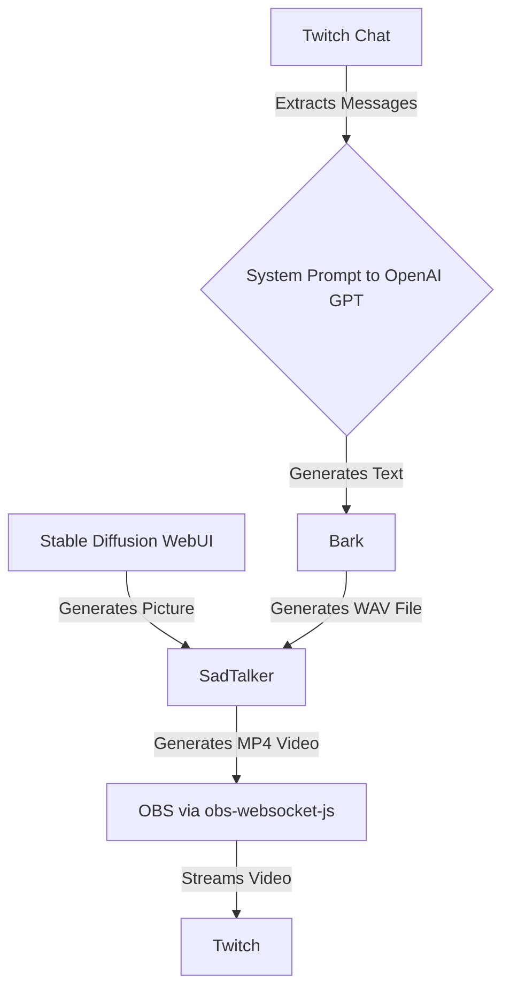

# strai

> Stream AI content to the world

<!-- toc -->

- [Prerequisites](#prerequisites)
- [Getting started](#getting-started)
- [Concept](#concept)
- [Under the hood](#under-the-hood)
  * [Remote control OBS](#remote-control-obs)
    + [Base setup](#base-setup)
  * [How it works](#how-it-works)

<!-- tocstop -->

## Prerequisites

Before running the application, make sure you have the following prerequisites installed:

- [Node.js](https://nodejs.org) (version 18.16 or higher) (run `nvm use` if you use [NVM](https://github.com/nvm-sh/nvm) or similar tools)
- [Twitch](https://www.twitch.tv) account with [stream key](https://help.twitch.tv/s/article/twitch-stream-key-faq?language=en_US) for streaming & a [registered app](https://dev.twitch.tv/console) (client-id & client-secrect) to read messages from the chat

## Getting started

TODO: Clone and install and create the env and everything else

## Concept

This diagram describes the following steps:

1. `Stable Diffusion WebUI` generates a picture of a person which is used by [`SadTalker`](https://github.com/OpenTalker/SadTalker).
2. Messages are extracted from `Twitch Chat` and transformed into an API call to `OpenAI GPT` using strong system prompt that represents a specific persona.
3. The system prompt to `OpenAI GPT` generates a response to the chat message which is fed to [`Bark`](https://github.com/suno-ai/bark).
4. `Bark` generates a WAV file based on the provided text.
5. `SadTalker` combines the picture from `Stable Diffusion WebUI` and the WAV file from `Bark` to generate an MP4 video, which contains a face that speaks
6. The generated MP4 video is then input into `OBS` using `obs-websocket-js`.
7. `OBS` streams the video to `Twitch`.

## Under the hood

### Remote control OBS

#### Base setup

You need to create the following base setup:

* A **scene** named `default` with an **Sources > Media Source** named `defaultVideo` with the following configuration
  * Local file: true
  * Loop: true
  * Restart playback when source becomes available: true
  * Use hardware decoding when available: true
  * Show nothing when playback ends: false
  * Close file when inactive: false
  * Leave all other settings on their defaults
* A **scene** named `queue` with 
* A **scene** named `stream` with
  * **Sources > Group** named `setup`
  * **Sources > Scene** and select `default` and put it into the group `setup`
  * **Sources > Scene** and select `queue` and put it into the group `setup`
  * Make sure that the scenes inside the group are in this order:
    * `queue`
    * `default`

### How it works

* Enable the `defaultVideo`
  * This makes sure that we have a loop constantly running when nothing is happening
* When `OBSRemoteControl.addVideo` is called:
  * Add the video to a video queue
    * This creates a new Media Source inside of `queue` using the same transform settings that were used to position the `defaultVideo`. It will also set the audio output to "Monitor and Output" so that the video's audio is hearable in the stream
* The oldest video from the video queue will be played
  * Once the video is playing in OBS, it will be removed from the video queue
* Once the video playback ended in OBS, the video will be removed from OBS
