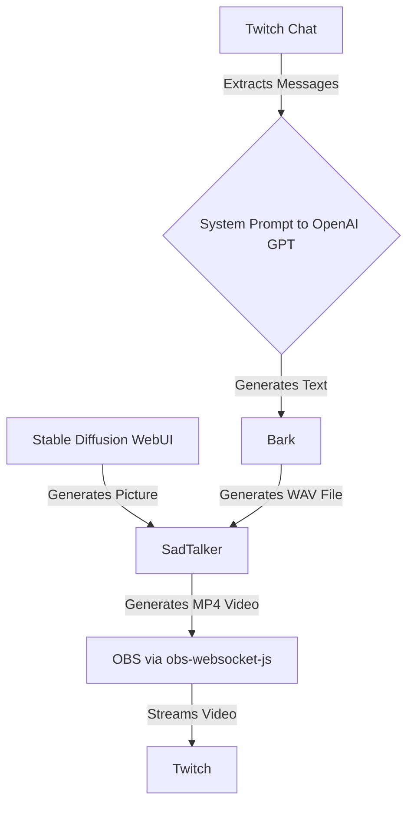

# strai

> Stream AI content to the world

This diagram describes the following steps:

1. `Stable Diffusion WebUI` generates a picture of a person which is used by [`SadTalker`](https://github.com/OpenTalker/SadTalker).
2. Messages are extracted from `Twitch Chat` and transformed into an API call to `OpenAI GPT` using strong system prompt that represents a specific persona.
3. The system prompt to `OpenAI GPT` generates a response to the chat message which is fed to [`Bark`](https://github.com/suno-ai/bark).
4. `Bark` generates a WAV file based on the provided text.
5. `SadTalker` combines the picture from `Stable Diffusion WebUI` and the WAV file from `Bark` to generate an MP4 video, which contains a face that speaks
6. The generated MP4 video is then input into `OBS` using `obs-websocket-js`.
7. `OBS` streams the video to `Twitch`.
